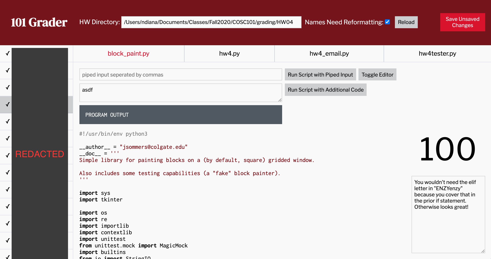

# 101 Grader



## Purpose
Navigate, edit, run, and grade files for COSC101 in one window and without having to leave the keyboard.

## Usage

1. Run `node app.js` to start server. Then navigate to `127.0.0.1:3000`

2. Once, the webpage opens, update the path in the **HW Directory** field to be the path to the directory containing a directory called `output` which contains directories for each student. For example:

```
|-- /Users/ndiana/Documents/Classes/Fall2020/COSC101/grading/hw04
|   |-- output/
|       |-- smithjo/
|       |-- jonesja/
|       |-- millerwi/
...
```

**Note:** This directory can either be the resulting directory created by running Joel's reformatting/testing script OR simply the unzipped submissions file from Moodle. However, in the latter case, you should also tick the **Names Need Reformatting** box, because the program uses directory names as the source for student names. In either case, the program looks for the specific directory named `output`.

3. Click **Reload** to reload the page with the new directory. The information you enter is saved in your browswer's local storage, so you only have to do this once for each assignment.

4. Grade student work, clicking the **Save Unsaved Changes** button periodically.

5. To generate a grades file that you can import into moodle: see *Make Grade File* below

## Shortcuts

### Navigating Students
&downarrow; (Down Arrow) = Next Student  
&uparrow; (Up Arrow) = Previous Student  

### Navigating Files
&leftarrow; (Left Arrow) = Previous File  
&rightarrow; (Right Arrow) = Next File  

### Grading
*Note: While Grade Input and Comment Input are selected, other navigation key shortcuts are disabled*  
Tab = Jump to **Grade Input**/Switch between **Grade Input** and **Comment Input**  
Escape = Exit **Grade Input** or **Comment Input** (re-enable other shortcuts)

## Other Functions

### Editing and Running Student Code
Student code is often *almost* functional. Editing allows us to test the code with minor corrections, so that we can know if the problem is a small grammatical issue, or a larger conceptual one.

There are three ways to edit and run student py files:
1. With piped standard input (nice for testing)
2. With additional code appended to the end of the file (again, nice for testing)
3. By toggling the editor, making your edits and clicking `Run Edited Script`

*Note:* The appended code will persist across students (for testing purposes). Additionally, running with appended code or running an edited script also, by default, runs with piped input.

### Using Grader Scripts
Clicking the `Run grader.py` button will ask the software to look for a grader file called `grader.py`, copy to each student directory, run it, and then remove it from each student directory.

### Make Grade File
Runs `mkgradesheet.py` which looks for a file called `moodleGrades.csv` in the HW directory. This is the grading worksheet that you can export from moodle for an assignment (View all submissions -> Grading Actions -> Download grading worksheet).

### Copy Common Files
If there are files required to run each student's code (that aren't already included in their directories), you can use this button to copy files from a directory named `copy` in the HW directory (i.e., is a sibling to the `output` directory) to each student directory.